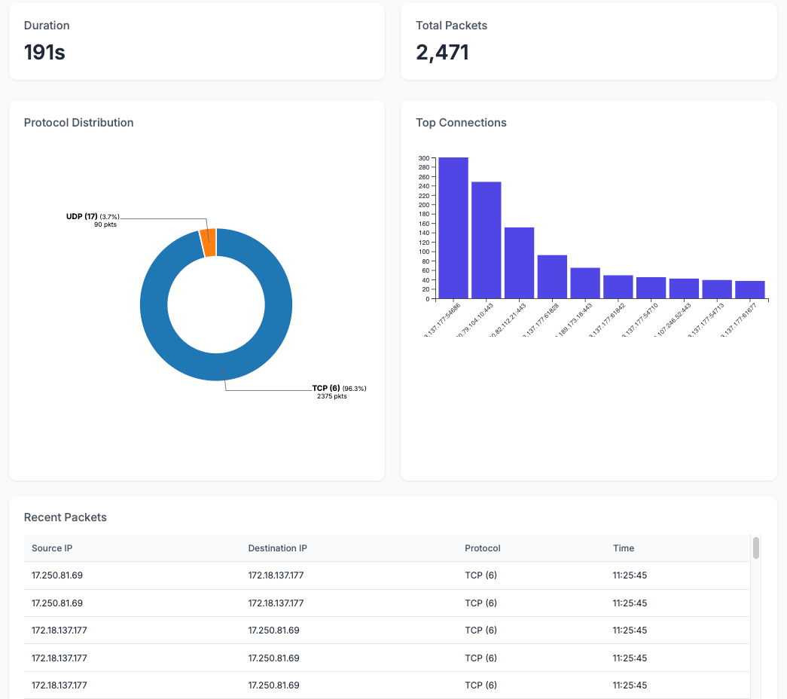

# Network Protocol Analysis Guide

This readme provides some information about common network protocols and how to analyse their frames using this packet sniffer tool. 

## Installation
1. Clone the repository
```bash
git clone https://github.com/AnthonyLovesCoffee/Custom-Packet-Sniffer.git
```
```bash
cd Custom-Packet-Sniffer
```
2. Install dependencies:
```bash
pip install -r requirements.txt
```

## Usage

1. Start the application:
```bash
sudo python3 run.py
```

2. Access the dashboard at `http://localhost:5000`

## Dashboard

## Common Network Protocols

[TCP, UDP, ICMP - frame breakdown](docs/PROTOCOLS.md)

### Basic Usage (only the analyser)

```bash
python network_analyzer.py -v  # Run with verbose output
python network_analyzer.py -t 60  # Capture for 60 seconds
python network_analyzer.py -o output.csv  # Save results to a CSV
```

## Protocol Statistics

The analyzer tracks various statistics for each protocol:
- Packet counts by protocol
- Connection frequencies
- Source/destination patterns
- Traffic volume

### Output Format

The analyzer generates two types of output:

1. JSON Statistics (`network_stats.json`):
```json
{
    "duration": 300.5,
    "total_packets": 1000,
    "protocols": {
        "TCP": 750,
        "UDP": 200,
        "ICMP": 50
    },
    "top_connections": {
        "192.168.1.1:80 -> 192.168.1.2:443": 100
    }
}
```
