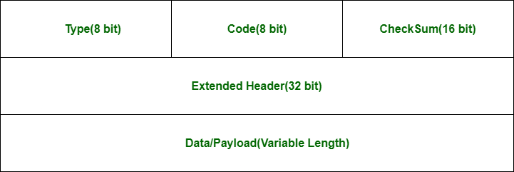

### TCP (Transmission Control Protocol)

TCP is a connection-oriented protocol that ensures reliable, ordered data delivery.
It establishes a dedicated end-to-end connection (three-way handshake) and maintains a connected state throughout transmission

SYN → SYN-ACK → ACK sequence  

#### Frame Structure


#### Analysing TCP with Scapy
```python
from scapy.all import *

def analyse_tcp(packet):
    if TCP in packet:
        tcp = packet[TCP]
        print(f"Source Port: {tcp.sport}")
        print(f"Destination Port: {tcp.dport}")
        print(f"Sequence Number: {tcp.seq}")
        print(f"Acknowledgment: {tcp.ack}")
        print(f"Flags: {tcp.flags}")
```

### UDP (User Datagram Protocol)

UDP is a connectionless protocol that provides fast, unreliable data transmission. There is no congestion control or any guarantee of the packets delivery or order. This makes it more efficient by reducing overhead and handshaking delays.

#### Frame Structure


#### Analysing UDP with Scapy
```python
def analyse_udp(packet):
    if UDP in packet:
        udp = packet[UDP]
        print(f"Source Port: {udp.sport}")
        print(f"Destination Port: {udp.dport}")
        print(f"Length: {udp.len}")
        print(f"Checksum: {udp.chksum}")
```

### ICMP (Internet Control Message Protocol)

ICMP is used for network diagnostics and error reporting. It is mainly used for network testing as it reports on errors in packet processing and provides diagnostic information on the network.

#### Common ICMP Types:
- Type 0: Echo Reply
- Type 3: Destination Unreachable
- Type 8: Echo Request
- Type 11: Time Exceeded

#### Frame Structure


#### Analysing ICMP with Scapy
```python
def analyse_icmp(packet):
    if ICMP in packet:
        icmp = packet[ICMP]
        print(f"ICMP Type: {icmp.type}")
        print(f"ICMP Code: {icmp.code}")
        print(f"Checksum: {icmp.chksum}")
```